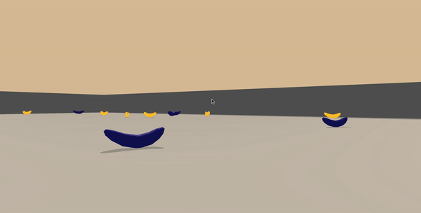

# Unity Banana Navigation

This is an implementaiton of Udacity Deep Reinforcement Learning Nanodegree's first project. In this project, the agent's goal is to navigate through blue bananas in a square world to collect the yellow ones. 



## Environment Details

| Space        | Type           | Description  |
| ------------- |:-------------:| :-----|
| Observation      | Continuous | Contains the agent's velocity, along with ray-based perception<br> of objects around agent's forward direction |
| Action      | Discrete      |  0. Forward<br>  1. Backward<br> 2. Left<br> 3. Right  |
| Reward      | Discrete      |  Yellow Banana -> +1 <br> Blue Banana -> -1 |

## Getting Started
Make sure the environment and the Python interface have compatible versions (Python 3.6). 
```bash
foo@bar:~$ python --version                                                                                      
Python 3.6.5 :: Anaconda, Inc.
```
Install the dependencies or install the project using pip. 
```bash
foo@bar:~$ pip install -r requirements.txt
```
or 
```bash
foo@bar:~$ pip install . -e
```

## Run the Agent
`main.py` is the cli to train/watch the agent. 
```bash
foo@bar:~$ python main.py -h
usage: main.py [-h] [--train]

Banana Navigation Agent

optional arguments:
  -h, --help      show this help message and exit
  --train         Train the DQN agent if used, else load the trained weights
                  and play the game
  --weights PATH  path of .pth file with the trained weights
```
For further details run `Navigation.ipynb`.
