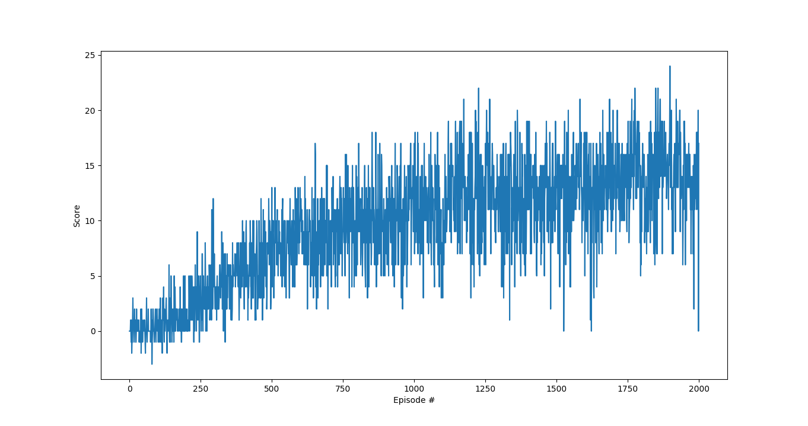

# Report

## Learning Algorithm
The reinforcement learning algorithm implemented in the project is [Double DQ-learning](https://arxiv.org/pdf/1509.06461.pdf). 
Double DQ-learning aimes at decoupling the process of choosing the best actions from the estimation of action-values. This would address the issue of overestimation of the action-values which exists in [Vanilla Deep Q-Learning](https://storage.googleapis.com/deepmind-media/dqn/DQNNaturePaper.pdf).
In this implementation, the input is a state vector and not the raw pixels. Hence, the CNN layers in the action-value network are replaced with ANN.


### Action Value Network Architecture

| Layer Name      | Layer Type,| Input Dimension          | Ouput Dimension |
| -------------|:-------:|:-------------:| -----:|
| input      | Linear with Relu|(37,) | (32,) |
| dropout      | Dropout |(32,) | (32,) |
| hidden      | Linear with Relu|(32,) | (16,) |
| output | Linear |(16,) | (4,) |


### Hyperparameters
```yaml
exp_replay:
    buffer: 5000 # replay buffer size
    batch: 64 # minibatch size
    update_every: 4 # how often to update the network
dq:
    gamma: 0.99 # discount factor
    tau: 1e-3 # for soft update of target parameters
    lr: 5e-4 # learning rate
train:
    n_episodes: 2500
    max_t: 1000
    eps_start: 1.0
    eps_end: 1e-2
    eps_decay: 0.999
```

## Results

```
Episode 100     Average Score: 0.42
Episode 200     Average Score: 2.34
Episode 300     Average Score: 5.01
Episode 400     Average Score: 6.67
Episode 500     Average Score: 8.38
Episode 600     Average Score: 9.96
Episode 700     Average Score: 11.15
Episode 800     Average Score: 11.54
Episode 900     Average Score: 11.13
Episode 1000    Average Score: 12.67
Environment solved in 935 episodes!     Average Score: 13.05
```
## Ideas for Improvements

- Hyperparameter Tuning
- [Rainbow](https://arxiv.org/pdf/1710.02298.pdf)
    - Double DQN (DDQN)
    - [Prioritized experience replay](https://arxiv.org/abs/1511.05952)
    - [Dueling DQN](https://arxiv.org/abs/1511.06581)
    - [Learning from multi-step bootstrap targets](https://arxiv.org/abs/1602.01783)
    - [Noisy DQN](https://arxiv.org/abs/1706.10295)
    - [Distributional DQN](https://arxiv.org/abs/1707.06887)
    
